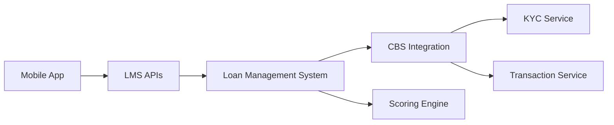

# Digital Lending Platform

A Django-based Loan Management System (LMS) that integrates with a Core Banking System (CBS) and Scoring Engine to provide micro loans to bank customers through a mobile banking application.

## Table of Contents
- [Features](#features)
- [System Architecture](#system-architecture)
- [Setup and Installation](#setup-and-installation)
- [API Documentation](#api-documentation)
- [Test Data](#test-data)
- [Environment Setup](#environment-setup)
- [Integration Details](#integration-details)
- [Development](#development)
- [Error Handling](#error-handling)
- [Response Formats](#response-formats)

## Features

- **Customer Management**
  - Customer subscription handling
  - KYC verification through CBS
  - Transaction history analysis

- **Loan Processing**
  - Real-time loan application processing
  - Automated credit scoring
  - Multi-step verification process
  - Concurrent loan prevention

- **Integration Services**
  - CBS Integration (KYC & Transaction data)
  - Scoring Engine Integration
  - Mobile App API endpoints

- **System Features**
  - Automated retry mechanism
  - Asynchronous processing
  - Error handling and monitoring
  - Secure API authentication

## System Architecture



## Setup and Installation

### Prerequisites
- Python 3.8+
- MySQL Server
- Git

### Installation Steps

1. **Clone the Repository**
```bash
git clone https://github.com/OwinoLucas/Digital-Lending-Platform.git
```

2. **Create and Activate Virtual Environment**
```bash
python -m venv venv
source venv/bin/activate  # Linux/Mac
# or
.\venv\Scripts\activate  # Windows
```

3. **Install Dependencies**
```bash
pip install -r requirements.txt
```

4. **Environment Configuration**
```bash
# Copy the example .env file and modify as needed
cp .env.example .env

# For development mode (uses mock services)
# Set DJANGO_ENV=development in .env

# For production mode (uses real external services)
# Set DJANGO_ENV=production in .env or remove the line
```

5. **Setup MySQL Database**
```bash
mysql -u root -p
CREATE DATABASE lms_db;
CREATE USER '<USERNAME>'@'localhost' IDENTIFIED BY '<YOURPASSWORD>';
GRANT ALL PRIVILEGES ON lms_db.* TO '<USERNAME>'@'localhost';
FLUSH PRIVILEGES;
```

6. **Run Migrations**
```bash
python manage.py makemigrations
```
then
```bash
python manage.py migrate
```

7. **Create Admin User**
```bash
python manage.py createsuperuser
Username: admin
Password: pwd123
```

8. **Run the Server**
```bash
python manage.py runserver
```

## Development

### Running Tests
```bash
python manage.py test
```


<!-- ## API Documentation

### Authentication
All APIs require Bearer token authentication except where noted.

### 1. Subscription API
**Endpoint:** `POST /api/v1/subscribe/`
**Purpose:** Register a customer for loan services

**Request:**
```json
{
    "customer_number": "234774784"
}
```

**Response:**
```json
{
    "status": "success",
    "message": "Customer successfully subscribed",
    "subscription_id": "uuid"
}
```

### 2. Loan Request API
**Endpoint:** `POST /api/v1/loan/request/`
**Purpose:** Submit a loan application

**Request:**
```json
{
    "customer_number": "234774784",
    "amount": 5000
}
```

**Response:**
```json
{
    "loan_id": "uuid",
    "status": "PROCESSING",
    "message": "Loan application received"
}
```

### 3. Loan Status API
**Endpoint:** `GET /api/v1/loan/status/<loan_id>/`
**Purpose:** Check loan application status

### 4. Transaction Data API
**Endpoint:** `GET /api/v1/transactions/<customer_number>/`
**Purpose:** Retrieve customer transaction history
**Authentication:** Basic Auth -->

## Test Data

### Test Customer Numbers
```python
TEST_CUSTOMERS = [
    "234774784",  # Regular customer
    "318411216",  # High-value customer
    "340397370",  # New customer
    "366585630",  # Existing loan customer
    "397178638"   # Rejected customer
]
```

## Environment Setup

This application supports both development and production environments through environment variables.

### Environment Configuration
The application uses a `.env` file to configure environment variables. See the `ENVIRONMENT_GUIDE.md` for detailed information.

### Development vs Production Mode
You can set the mode using the `DJANGO_ENV` environment variable:

```bash
# Development Mode (uses mock services)
export DJANGO_ENV=development
python manage.py runserver

# Production Mode (connects to external APIs)
export DJANGO_ENV=production  # or don't set it (defaults to production)
python manage.py runserver
```

### Automatic Fallback
The system includes an automatic fallback mechanism that switches to mock services if external APIs are unreachable. This ensures the application can run even when offline or when external services are down. See `ENVIRONMENT_GUIDE.md` for details.

## Integration Details

### Core Banking System (CBS)
```python
CBS_CONFIG = {
    "kyc_wsdl": "https://kycapitest.credable.io/service/customerWsdl.wsdl",
    "transaction_wsdl": "https://trxapitest.credable.io/service/transactionWsdl.wsdl",
    "auth": {
        "username": "admin",
        "password": "pwd123"
    }
}
```

### Scoring Engine
- **Base URL:** `https://scoringtest.credable.io` 
- **Process:**
  1. Initialize scoring (returns token)
  2. Check score status (using token)
  3. Retrieve final score
- **Retry Configuration:**
  - Max attempts: 3
  - Interval: 5 minutes

## Error Handling

| Error Code | Description | Resolution |
|------------|-------------|------------|
| 400 | Invalid customer number | Verify customer number |
| 409 | Existing active loan | Wait for current loan completion |
| 429 | Too many scoring retries | Application marked as failed |

## Response Formats

### Loan Status Response
```json
{
    "id": "uuid",
    "customer": "customer_id",
    "amount": "decimal",
    "status": "PENDING|PROCESSING|APPROVED|REJECTED|FAILED",
    "created_at": "datetime",
    "updated_at": "datetime"
}
```

### Transaction Data Response
```json
{
    "account_number": "string",
    "monthly_balance": "decimal",
    "credit_transactions_amount": "decimal",
    "monthly_debit_transactions_amount": "decimal",
    "last_transaction_date": "datetime"
}
```